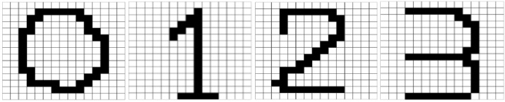

# Digit Guesser


Unlike the xor experiment I decided to start with something that has more impact, like image recognition, and for that I developed a canvas where you can draw pixels and train the network to predict other similar drawings later.



## Getting Started

### Install & Start

Install development packages.

```sh
npm install
```

Start development server.

```sh
npm run serve
```

### Using & Having fun

- Navigate to http://localhost:8080/
- Start drawing some digits and training the network.
- After training for a while, start to predict predict some digits.

## License

[MIT](https://balmante.eti.br)
